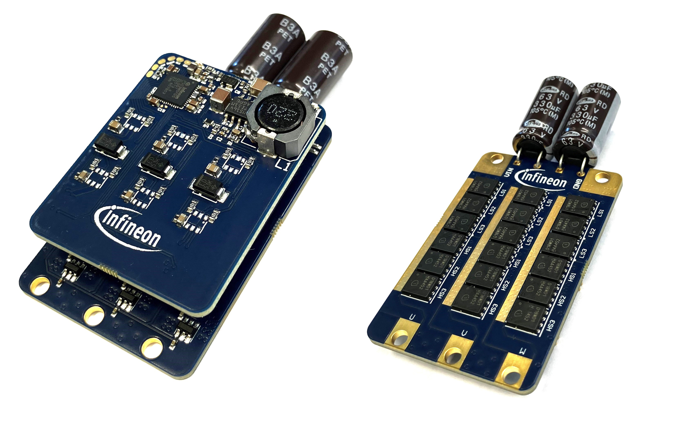
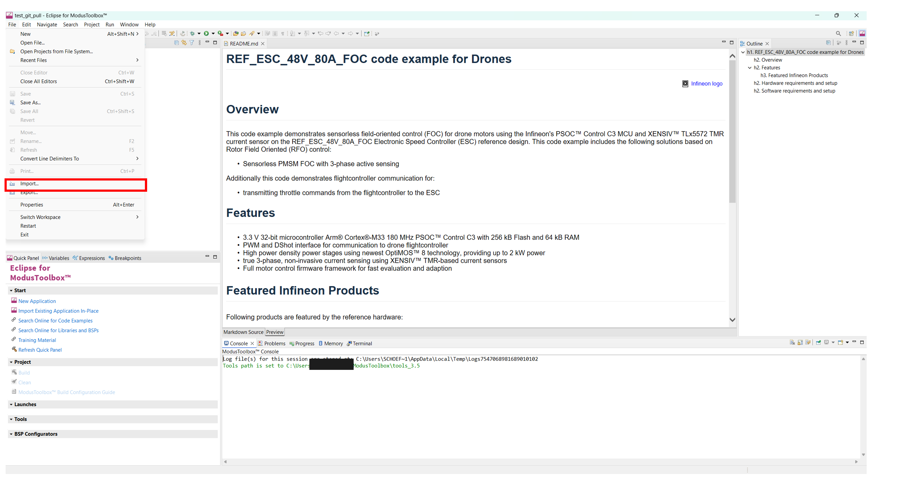
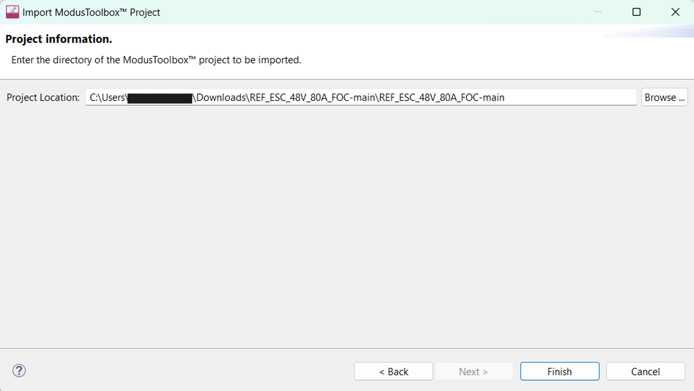
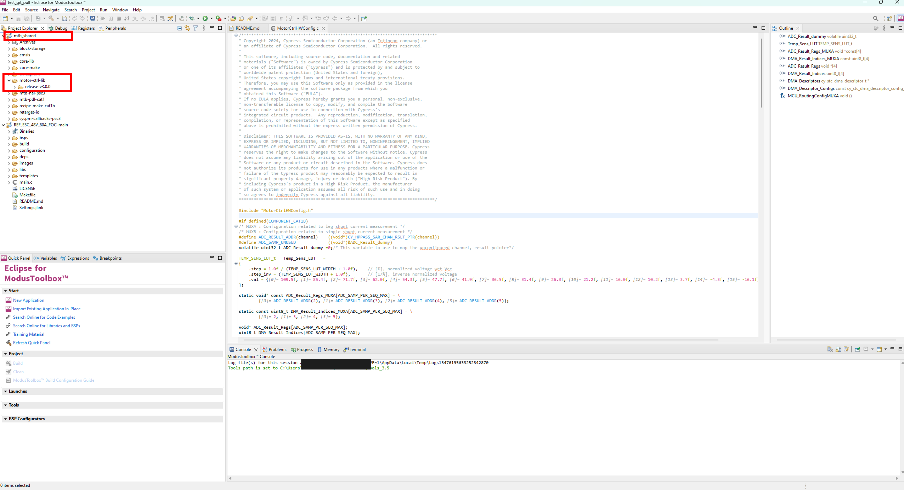
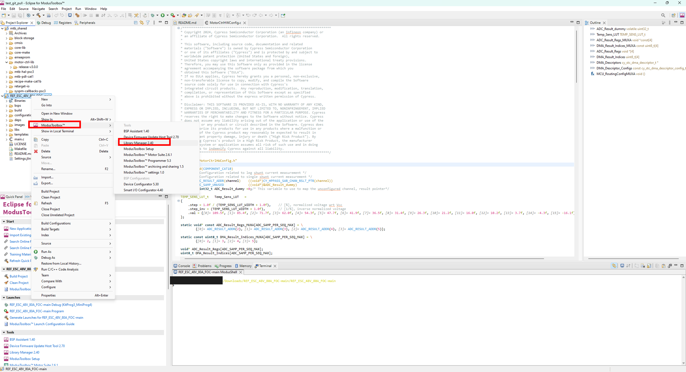
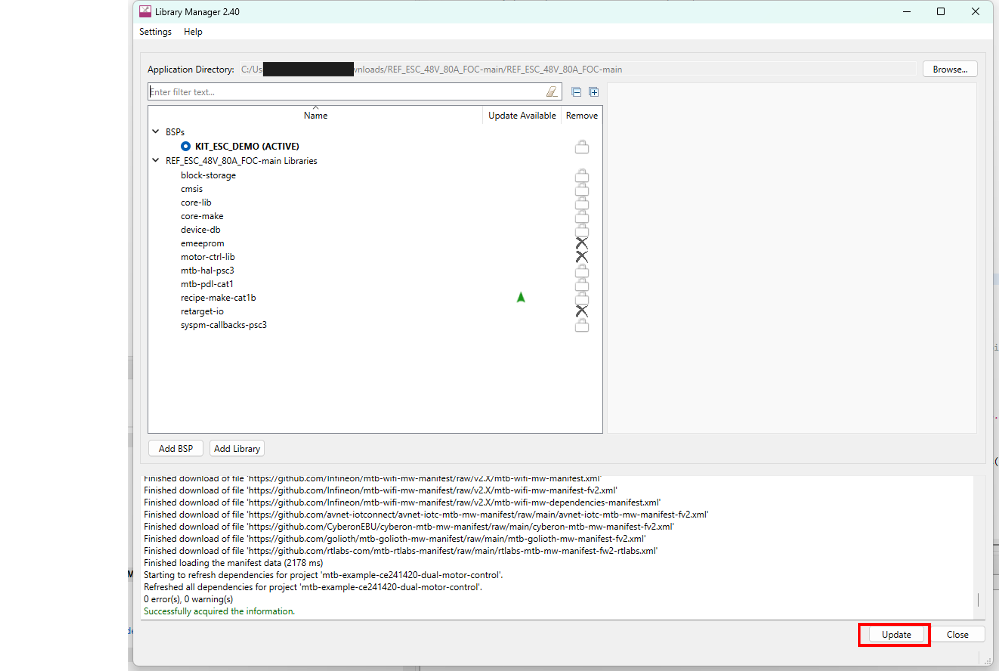
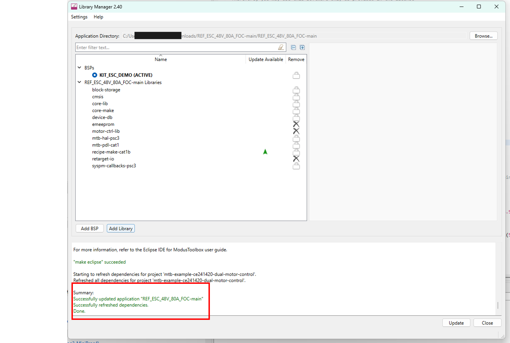

# REF_ESC_48V_80A_FOC code example

 
 

## Overview

This code example demonstrates sensorless field-oriented control (FOC) for drone motors using the Infineon's PSOC™ Control C3 MCU and XENSIV™ TLx5572 TMR current sensor on the REF_ESC_48V_80A_FOC Electronic Speed Controller (ESC) reference design. This code example includes the sensorless PMSM FOC with 3-phase active sensing solution based on Rotor Field Oriented (RFO) control. Additionally this code demonstrates flightcontroller communication for transmitting throttle commands from the flightcontroller to the ESC. 
 
<picture>
        
</picture>
 
## Features

- 3.3 V 32-bit microcontroller Arm® Cortex®-M33 180 MHz PSOC™ Control C3 with 256 kB Flash and 64 kB RAM
- PWM and DShot interface for communication to drone flightcontroller
- High power density power stages using newest OptiMOS™ 8 technology, providing up to 2 kW power
- true 3-phase, non-invasive current sensing using XENSIV™ TMR-based current sensors
- Full motor control firmware framework for fast evaluation and adaption

### Featured Infineon Products 

Following products are featured by the reference hardware:
 
 
<table style="width:100%">
  <tr>
    <th>Product</th>
    <th>Description</th>
  </tr>
  <tr>
    <td><a href="https://www.infineon.com/part/PSC3M5FDS2LGQ1">PSC3M5FDS2LGQ1</a></td>
    <td>PSOC™ Control C3 - high performance microcontroller tailored for motor control</td>
  </tr>
  <tr>
    <td><a href="no link">TLE5572-AE04E1-R-E0001</a></td>
    <td>XENSIV™ TLE5572 TMR-based current sensor with integrated op-amp</td>
  </tr>
  <tr>
    <td><a href="https://www.infineon.com/part/1EDN7550B">1EDN7550B</a></td>
    <td>EiceDRIVER™ 1EDN7550B TDI gate driver</td>
  </tr>
  <tr>
    <td><a href="no link">ISC019N10NM8</a></td>
    <td>OptiMOS™ 8 power MOSFET 100 V, 1.9 mΩ in a SuperSO8 (5x6) package</td>
  </tr>
  <tr>
    <td><a href="https://www.infineon.com/part/TLS202B1MBV33">TLS202B1MBV33</a></td>
    <td>Monolithic integrated post voltage regulator for load currents up to 150 mA</td>
  </tr>
</table>

 

## Hardware requirements and setup

- ESC reference design board: REF_ESC_48V_80A_FOC (link to board coming soon).
- Associated motor, with known motor parameters. This example code is tuned for the following motor: [T-MOTOR MN1010 KV135](https://store.tmotor.com/product/mn1010-kv135-motor-navigator-type.html?srsltid=AfmBOopD3lbwFgz0K8ZUy3XOd1RxaxusDyx5FUrMTmFEpbElm3Bks7fq)
- Programmer and Debugger for the board e.g. [XMC™ Link](https://www.infineon.com/evaluation-board/KIT-XMC-LINK-SEGGER-V1).

See the respective kit quick start guide for the hardware setup information. For details, see the User Manual (link to user manual coming soon) of the above reference design board. 

## Software requirements and setup

- [ModusToolbox™](https://www.infineon.com/modustoolbox) v3.5 or later. See the [ModusToolbox™ tools package installation guide](https://www.infineon.com/ModusToolboxInstallguide) for information about installing and configuring the tools package.
- [ModusToolbox™ Motor Suite](https://softwaretools.infineon.com/tools/com.ifx.tb.tool.ifxmotorsolutions?_gl=1*1ua47i0*_gcl_au*MTA4NjIyMTM2OC4xNzU1MTc0ODI1*_ga*MjEzNDIwNzg4MS4xNjk0NjkzMTU1*_ga_KVD0BL538B*czE3NTc1MDQ0NDkkbzM0JGcxJHQxNzU3NTA0OTAxJGo1NSRsMCRoMTE1NjE3MTY3OA..) v2.6.1.
- Programming language: C
- [J-Link Software](https://www.segger.com/downloads/jlink/) v8.40 or greater to allow the use of XMC™ Link to program the board and debug the software. 

## Using the code example

<ol>
<li id="step1"> Clone the project repository into the local drive.
  </li>
<li id="step2"> Open the ModusToolbox™ IDE (e.g. Eclipse for ModusToolbox™ 2025.4) and import the project with the import wizard by pressing 'File' – 'Import…'.   
    <picture>
        
    </picture>
     
    &nbsp;
</li>
<li id="step3"> Select 'ModusToolbox™' – 'Import Existing Application In-Place' and press 'Next'.   
    <picture>
        
    </picture>
     
    &nbsp;
</li>
<li id="step4"> Find the Project Location by pressing 'Browse…', and select the project folder accordingly and press 'Finish'.   
    <picture>
        
    </picture>
     
    &nbsp;
</li>
<li id="step6"> Wait until the project is fully imported. Notice that additional folder 'mtb_shared' should be created (if there was none) in addition to the project folder itself, when the import is completed. This motor control project relies on the Infineon motor control library (current release is v3.0.0) provided in the ModusToolbox™ as shown inside the mtb_shared folder.  
    <picture>
        
    </picture>
     
    &nbsp;
</li>
<li id="step7"> Right click the project folder and select 'ModusToolbox™' followed by 'Library Manager 2...'.   
    <picture>
        
    </picture>
     
    &nbsp;
</li>
<li id="step8"> Press the 'Update' button   
    <picture>
        
    </picture>
     
    &nbsp;
</li>
<li id="step9"> When the Update is completed the sucessful messages should be displayed. If the update failed, try it again by repressing the 'Update' button. If this also fails, try to clean the project before trying it again.   
    <picture>
        
    </picture>
     
    &nbsp;
</li>
<li id="step9"> If a different motor then the tested ones are used, ensure that the motor parameters are set correctly. The header file with the parameters is found in */configuration/motor-ctrl-lib-config/ParamConfig.h*   
    <picture>
        
    </picture>
     
    &nbsp;
</li>