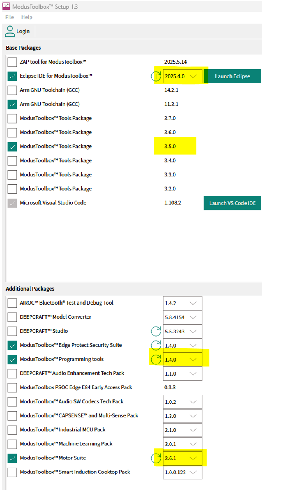
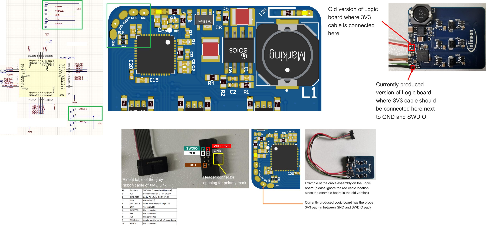
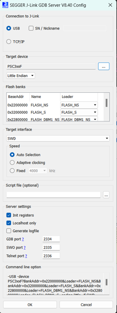
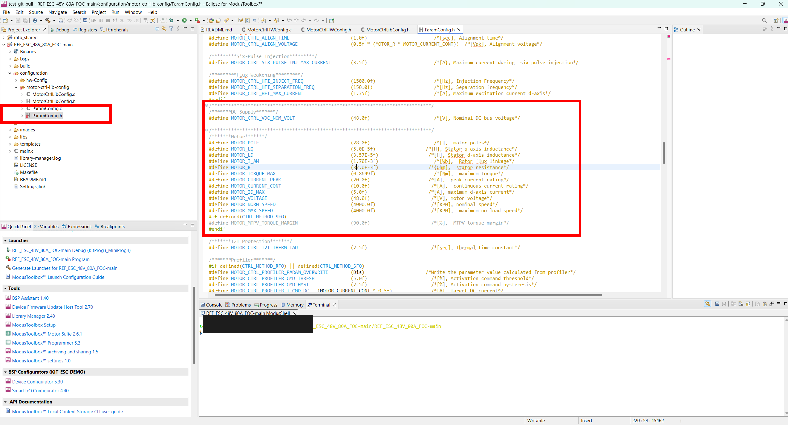
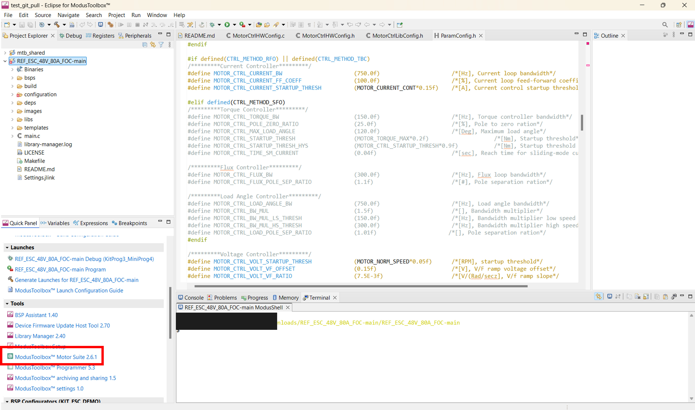
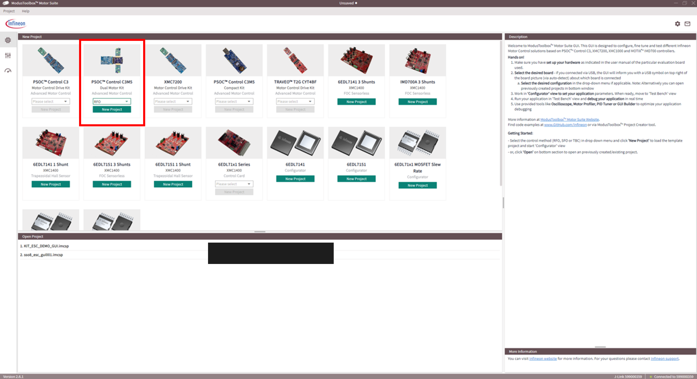
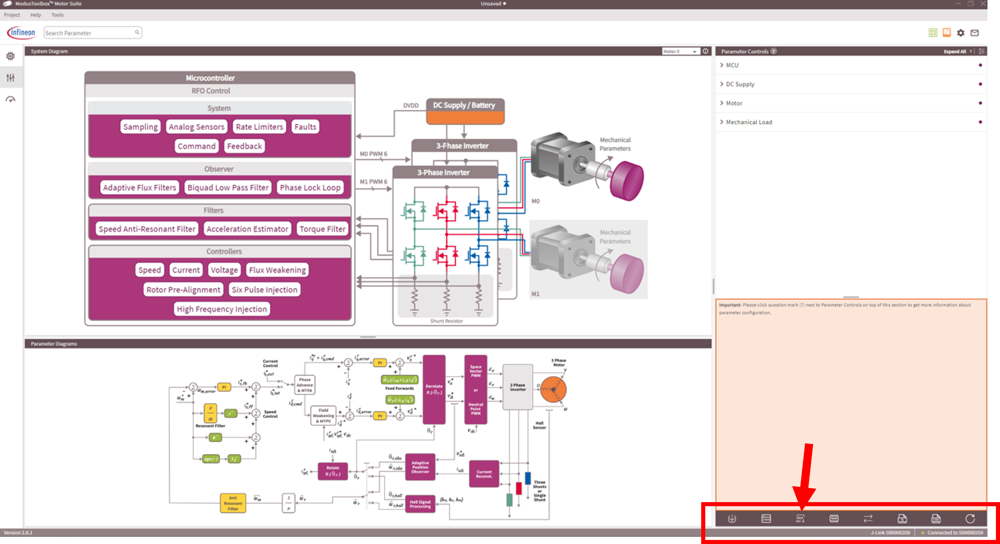
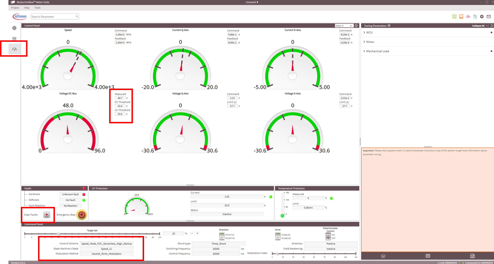
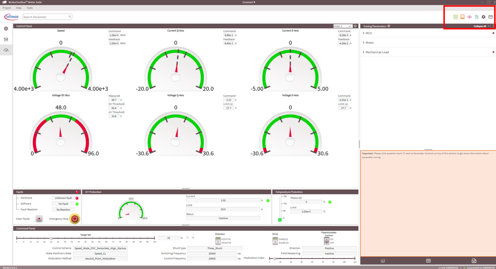
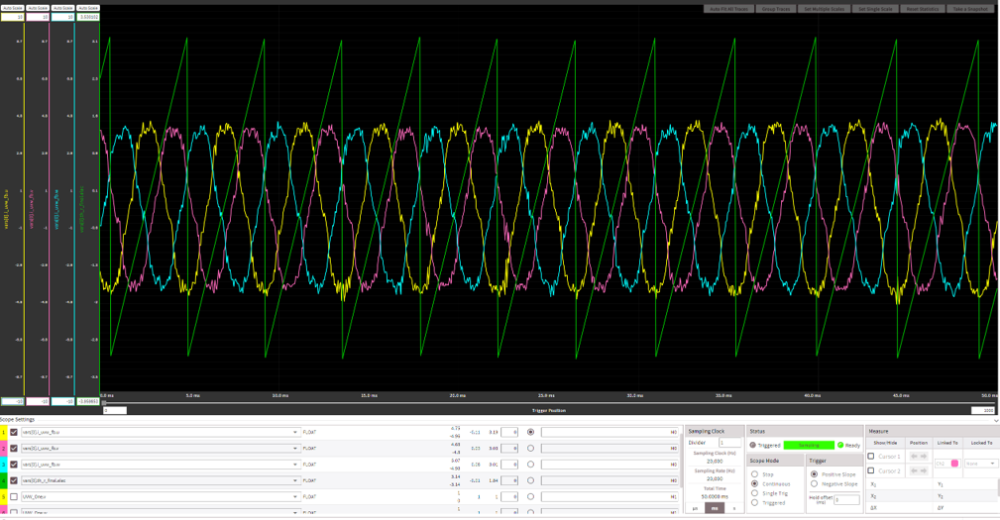

# REF_ESC_48V_80A_FOC code example

 
 
 
 

## Overview

This code example demonstrates sensorless field-oriented control (FOC) for drone motors using the Infineon's PSOC™ Control C3 MCU and XENSIV™ TLx5572 TMR current sensor on the REF_ESC_48V_80A_FOC Electronic Speed Controller (ESC) reference design. This code example includes the sensorless PMSM FOC with 3-phase active sensing solution based on Rotor Field Oriented (RFO) control. Additionally this code demonstrates flightcontroller communication for transmitting throttle commands from the flightcontroller to the ESC using DSHOT600 protocol implementation  
 
<picture>
        
</picture>
 
## Features

- 3.3 V 32-bit microcontroller Arm® Cortex®-M33 180 MHz PSOC™ Control C3 with 256 kB Flash and 64 kB RAM
- PWM and DShot interface for communication to drone flightcontroller
- High power density power stages using newest OptiMOS™ 8 technology, providing up to 2 kW power
- true 3-phase, non-invasive current sensing using XENSIV™ TMR-based current sensors
- Full motor control firmware framework for fast evaluation and adaption

### Featured Infineon Products 

Following products are featured by the reference hardware:
 
 
<table style="width:100%">
  <tr>
    <th>Product</th>
    <th>Description</th>
  </tr>
  <tr>
    <td><a href="https://www.infineon.com/part/PSC3M5FDS2LGQ1">PSC3M5FDS2LGQ1</a></td>
    <td>PSOC™ Control C3 - high performance microcontroller tailored for motor control</td>
  </tr>
  <tr>
    <td><a href="no link">TLE5572-AE04E1-R-E0001</a></td>
    <td>XENSIV™ TLE5572 TMR-based current sensor with integrated op-amp</td>
  </tr>
  <tr>
    <td><a href="https://www.infineon.com/part/1EDN7550B">1EDN7550B</a></td>
    <td>EiceDRIVER™ 1EDN7550B TDI gate driver</td>
  </tr>
  <tr>
    <td><a href="no link">ISC019N10NM8</a></td>
    <td>OptiMOS™ 8 power MOSFET 100 V, 1.9 mΩ in a SuperSO8 (5x6) package</td>
  </tr>
  <tr>
    <td><a href="https://www.infineon.com/part/TLS202B1MBV33">TLS202B1MBV33</a></td>
    <td>Monolithic integrated post voltage regulator for load currents up to 150 mA</td>
  </tr>
</table>

 

## Hardware requirements and setup

- ESC reference design board: REF_ESC_48V_80A_FOC (link to board coming soon).
- Associated motor, with known motor parameters. This example code is tuned for the following motor: [T-MOTOR MN1010 KV135](https://store.tmotor.com/product/mn1010-kv135-motor-navigator-type.html?srsltid=AfmBOopD3lbwFgz0K8ZUy3XOd1RxaxusDyx5FUrMTmFEpbElm3Bks7fq)
- Programmer and Debugger for the board e.g. [XMC™ Link](https://www.infineon.com/evaluation-board/KIT-XMC-LINK-SEGGER-V1).

See the respective kit quick start guide for the hardware setup information. For details, see the User Manual (link to user manual coming soon) of the above reference design board. 

## Software requirements and setup

- [ModusToolbox™](https://www.infineon.com/modustoolbox) version 3.5 (equals 2025.4.) with tools 3.5 version. See the [ModusToolbox™ tools package installation guide](https://www.infineon.com/ModusToolboxInstallguide) for information about installing and configuring the tools package.
- [ModusToolbox™ Motor Suite](https://softwaretools.infineon.com/tools/com.ifx.tb.tool.ifxmotorsolutions?_gl=1*1ua47i0*_gcl_au*MTA4NjIyMTM2OC4xNzU1MTc0ODI1*_ga*MjEzNDIwNzg4MS4xNjk0NjkzMTU1*_ga_KVD0BL538B*czE3NTc1MDQ0NDkkbzM0JGcxJHQxNzU3NTA0OTAxJGo1NSRsMCRoMTE1NjE3MTY3OA..) v2.6.1.
- Programming language: C
- [J-Link Software](https://www.segger.com/downloads/jlink/) v8.40 or greater to allow the use of XMC™ Link to program the board and debug the software. 

For a detailed versioning of the software packages please see image below. **Please note, that the firmware was only tested and confirmed with these software tool versions.**
<picture>
        
</picture>

## Hardware preparation

The debugger connection to the board is shown in the image below. Please make sure that 3V3, GND and the RESET pin are connected for correct operation.
<picture>
        
</picture>

Make sure that the debug settings of your debugger are set as follows
<picture>
        
</picture>

The board should be recognized by the debugger and the firmware can be flashed.

## Using the code example

<ol>
<li id="step1"> Clone the project repository into the local drive.
  </li>
<li id="step2"> Open the ModusToolbox™ IDE (e.g. Eclipse for ModusToolbox™ 2025.4) and import the project with the import wizard by pressing 'File' – 'Import…'.   
    <picture>
        
    </picture>
     
    &nbsp;
</li>
<li id="step3"> Select 'ModusToolbox™' – 'Import Existing Application In-Place' and press 'Next'.   
    <picture>
        
    </picture>
     
    &nbsp;
</li>
<li id="step4"> Find the Project Location by pressing 'Browse…', and select the project folder accordingly and press 'Finish'.   
    <picture>
        
    </picture>
     
    &nbsp;
</li>
<li id="step6"> Wait until the project is fully imported. Notice that additional folder 'mtb_shared' should be created (if there was none) in addition to the project folder itself, when the import is completed. This motor control project relies on the Infineon motor control library (current release is v3.0.0) provided in the ModusToolbox™ as shown inside the mtb_shared folder.  
    <picture>
        
    </picture>
     
    &nbsp;
</li>
<li id="step7"> Right click the project folder and select 'ModusToolbox™' followed by 'Library Manager 2...'.   
    <picture>
        
    </picture>
     
    &nbsp;
</li>
<li id="step8"> Press the 'Update' button   
    <picture>
        
    </picture>
     
    &nbsp;
</li>
<li id="step9"> When the Update is completed the sucessful messages should be displayed. If the update failed, try it again by repressing the 'Update' button. If this also fails, try to clean the project before trying it again.   
    <picture>
        
    </picture>
     
    &nbsp;
</li>
<li id="step9"> Ensure that the motor parameters are set correctly. The header file with the parameters is found in /configuration/motor-ctrl-lib-config/ParamConfig.h. Also, when the DC bus voltage differs from the pre-set 48 V, change ADC_SCALE_VDC to scale for correct voltage readings.  
    <picture>
        
    </picture>
     
    &nbsp;
</li>
<li id="step11"> After updating the parameters, the firmware can be flashed to the device.   
    <picture>
        
    </picture>
     
    &nbsp;
</li>

## Using Motor Suite GUI

For direct evaluation of the motor control library it is recommended to use ModusToolbox™ Motor Suite. ModusToolbox™ Motor Suite allows real-time data monitoring using oscilloscope functions as well as easy change of control parameters written to the MCUs flash memory. 

<ol>
<li id="step1"> Open ModusToolbox™ Motor Suite v2.6.1 in the ModusToolbox™ IDE.   
    <picture>
        
    </picture>
     
    &nbsp;
</li>
<li id="step2"> Create a new project by selecting PSOC Control™ C3M5 (Dual Motor Kit) and RFO as control method.   
    <picture>
        
    </picture>
     
    &nbsp;
</li>
<li id="step2"> Now the GUI control center will show up. Make sure that you are connected to the debugger (bottom right corner). On the bottom right panel there are icons with different functionality. From left to right: i) "Write Parameters" allows you to update parameter changes in the GUI to the MCU's flash memory. ii) "Flash Firmware" allows flashing a new .hex file to the MCU. iii) "Select ELF file" maps symbols from the .elf file to the GUI. iv) "Read Device" reads current parameters and updates the GUI. It is important to use the correct .elf as well as .hex files to maintain correct GUI performance. If firmware was already flashed to the MCU within ModusToolbox™ IDE, ensure correct symbol mapping by performing "Select ELF file". Point to the target .elf file of your project in the /build/last_config folder and the GUI will update.  
    <picture>
        
    </picture>
     
    &nbsp;
</li>
<li id="step3"> In order to run the motor, change to the "Test Bench" view. The test bench provides live data and machine state information. Check if the bus voltage is displayed correctly. Also check that the machine state is in "Init" mode. If the state is "Faul", clear the faults by toggling the "Clear Fault" button  
    <picture>
        
    </picture>
     
    &nbsp;
</li>
<li id="step4"> The code example is set to speed control with alignment mode. Therefore, run the motor by setting a target speed (e.g. 20%) and the machine will transition to "Speed CL" state and the motor will spin.  
</li>

<li id="step5"> To investigate data while operation, ModusToolbox™ Motor Suite features an oscilloscope function. The icon is found on the top right corner.  
    <picture>
        
    </picture>
     
    &nbsp;
</li>

<li id="step6"> The oscilloscope displays phase currents as well as electrical angle estimates from the observer. Successful operation should display phase currents and phase angle as shown in the picture below.   
    <picture>
        
    </picture>
     
    &nbsp;
</li>

## Flightcontroller communication using DShot600 protocol 
The code example implements a DShot600 protocol decoder which allows the use of any off-the-shelf flightcontroller stacks such as Pixhawk 6. The main operation of the decoder is found in the function FC_PWM_COUNTER_IRQ_RunISR() within MCU.c. On the board, there are two DSHOT GPIO pins available which can be used in combination with the flightcontroller for speed control. 

## Other resources

Infineon provides a wealth of data at [www.infineon.com](https://www.infineon.com) to help you select the right device, and quickly and effectively integrate it into your design.

All referenced product or service names and trademarks are the property of their respective owners.

The Bluetooth® word mark and logos are registered trademarks owned by Bluetooth SIG, Inc., and any use of such marks by Infineon is under license.

PSOC™, formerly known as PSoC™, is a trademark of Infineon Technologies. Any references to PSoC™ in this document or others shall be deemed to refer to PSOC™.

---------------------------------------------------------

© Cypress Semiconductor Corporation, 2025. This document is the property of Cypress Semiconductor Corporation, an Infineon Technologies company, and its affiliates ("Cypress").  This document, including any software or firmware included or referenced in this document ("Software"), is owned by Cypress under the intellectual property laws and treaties of the United States and other countries worldwide.  Cypress reserves all rights under such laws and treaties and does not, except as specifically stated in this paragraph, grant any license under its patents, copyrights, trademarks, or other intellectual property rights.  If the Software is not accompanied by a license agreement and you do not otherwise have a written agreement with Cypress governing the use of the Software, then Cypress hereby grants you a personal, non-exclusive, nontransferable license (without the right to sublicense) (1) under its copyright rights in the Software (a) for Software provided in source code form, to modify and reproduce the Software solely for use with Cypress hardware products, only internally within your organization, and (b) to distribute the Software in binary code form externally to end users (either directly or indirectly through resellers and distributors), solely for use on Cypress hardware product units, and (2) under those claims of Cypress's patents that are infringed by the Software (as provided by Cypress, unmodified) to make, use, distribute, and import the Software solely for use with Cypress hardware products.  Any other use, reproduction, modification, translation, or compilation of the Software is prohibited.
 
TO THE EXTENT PERMITTED BY APPLICABLE LAW, CYPRESS MAKES NO WARRANTY OF ANY KIND, EXPRESS OR IMPLIED, WITH REGARD TO THIS DOCUMENT OR ANY SOFTWARE OR ACCOMPANYING HARDWARE, INCLUDING, BUT NOT LIMITED TO, THE IMPLIED WARRANTIES OF MERCHANTABILITY AND FITNESS FOR A PARTICULAR PURPOSE.  No computing device can be absolutely secure.  Therefore, despite security measures implemented in Cypress hardware or software products, Cypress shall have no liability arising out of any security breach, such as unauthorized access to or use of a Cypress product. CYPRESS DOES NOT REPRESENT, WARRANT, OR GUARANTEE THAT CYPRESS PRODUCTS, OR SYSTEMS CREATED USING CYPRESS PRODUCTS, WILL BE FREE FROM CORRUPTION, ATTACK, VIRUSES, INTERFERENCE, HACKING, DATA LOSS OR THEFT, OR OTHER SECURITY INTRUSION (collectively, "Security Breach").  Cypress disclaims any liability relating to any Security Breach, and you shall and hereby do release Cypress from any claim, damage, or other liability arising from any Security Breach.  In addition, the products described in these materials may contain design defects or errors known as errata which may cause the product to deviate from published specifications. To the extent permitted by applicable law, Cypress reserves the right to make changes to this document without further notice. Cypress does not assume any liability arising out of the application or use of any product or circuit described in this document. Any information provided in this document, including any sample design information or programming code, is provided only for reference purposes.  It is the responsibility of the user of this document to properly design, program, and test the functionality and safety of any application made of this information and any resulting product.  "High-Risk Device" means any device or system whose failure could cause personal injury, death, or property damage.  Examples of High-Risk Devices are weapons, nuclear installations, surgical implants, and other medical devices.  "Critical Component" means any component of a High-Risk Device whose failure to perform can be reasonably expected to cause, directly or indirectly, the failure of the High-Risk Device, or to affect its safety or effectiveness.  Cypress is not liable, in whole or in part, and you shall and hereby do release Cypress from any claim, damage, or other liability arising from any use of a Cypress product as a Critical Component in a High-Risk Device. You shall indemnify and hold Cypress, including its affiliates, and its directors, officers, employees, agents, distributors, and assigns harmless from and against all claims, costs, damages, and expenses, arising out of any claim, including claims for product liability, personal injury or death, or property damage arising from any use of a Cypress product as a Critical Component in a High-Risk Device. Cypress products are not intended or authorized for use as a Critical Component in any High-Risk Device except to the limited extent that (i) Cypress's published data sheet for the product explicitly states Cypress has qualified the product for use in a specific High-Risk Device, or (ii) Cypress has given you advance written authorization to use the product as a Critical Component in the specific High-Risk Device and you have signed a separate indemnification agreement.
 
Cypress, the Cypress logo, and combinations thereof, ModusToolbox, PSoC, CAPSENSE, EZ-USB, F-RAM, and TRAVEO are trademarks or registered trademarks of Cypress or a subsidiary of Cypress in the United States or in other countries. For a more complete list of Cypress trademarks, visit www.infineon.com. Other names and brands may be claimed as property of their respective owners.
